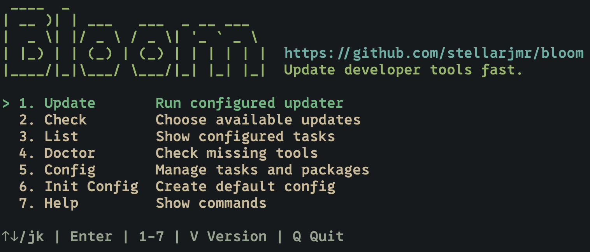

# Bloom

<p align="center">
  
</p>

Bloom is a config-driven terminal updater for developer tools on macOS. The command is intentionally short: `bm` opens the menu, and `bm update` runs the updater directly.



## Install

```bash
brew tap stellarjmr/tool
brew install stellarjmr/tool/bloom
```

The Homebrew formula installs prebuilt release binaries, so Go is only needed when building from source.

## Commands

```bash
bm                           # open the interactive menu
bm check                     # list available package updates
bm update                    # run enabled update tasks
bm update --dry-run          # inspect selected tasks without updating
bm update --only nvim        # run one task
bm update --package npm:pkg  # run one package from a task
bm update --skip npm         # skip a task
bm remove                    # remove packages with their package manager
bm remove --list             # list removable packages as TSV
bm remove --package npm:pkg  # remove one package from a task
bm uninstall                 # remove apps and their leftovers
bm uninstall --list          # list installed apps as TSV
bm uninstall --dry-run --app /Applications/Foo.app
bm list                      # list configured tasks
bm doctor                    # show available and missing tools
bm config                    # open the interactive config menu
bm config path               # print config path
bm config init               # create ~/.config/bloom/config.toml
```

Bloom uses portable terminal symbols so the interface works in standard terminal fonts.

## Default Tasks

The default task set updates everything Bloom can detect:

- `brew`: Homebrew formula updates
- `cask`: Homebrew cask updates
- `amp`: `amp update`
- `yazi`: Yazi plugin updates
- `nvim`: Neovim plugin updates for lazy.nvim/LazyVim and `vim.pack`
- `mason`: Mason package updates
- `npm`: global npm package updates

Missing tools are skipped during `bm update` and are not counted in the progress total. For Homebrew updates, Bloom refreshes Homebrew metadata before checking outdated formulae and casks, so packages from tapped repositories are included.

## Remove packages

`bm remove` removes packages using the owning package manager only. It does not delete package files directly and does not remove macOS app leftovers.

The interactive Remove flow lives above Uninstall in the main menu. It lists removable package sets from Config → Packages, then calls official removal APIs/commands such as `brew uninstall`, `ya pkg delete`, `npm uninstall -g`, and Mason's package uninstall API.

Homebrew casks and other `.app` bundles are handled by `bm uninstall`, which includes application leftovers. Neovim plugin install/removal is config-driven, so remove plugins from your Neovim configuration instead of using `bm remove`.

## Uninstall

`bm uninstall` removes a macOS `.app` bundle plus the leftovers most apps drop into `~/Library` (Application Support, Caches, Containers, Group Containers, HTTPStorages, WebKit, Logs, Saved Application State, Application Scripts, Preferences, ByHost preferences, LaunchAgents, and Cookies).

The interactive flow lives at menu item 3:

- All apps start unselected. `Space` toggles. `Enter` removes the cursor item when nothing is selected, or every selected item otherwise.
- Each row shows the app name, on-disk size, and last-used time (`kMDItemLastUsedDate`, with bundle mtime as a fallback). CJK and fullwidth names align by display width.
- The summary lists every removed path under each app (`✓` removed, `·` would-remove).

Per-app cleanup runs in this order so brew can detect and clean its own metadata:

1. Quit the app, unload its `LaunchAgents`.
2. Detect the Homebrew cask via the `<prefix>/Caskroom/<token>/<version>` layout (resolved-symlink → bundle-name search → `brew list`/`info` fallback) and run `brew uninstall --cask --zap --force <token>`, then verify with `brew list --cask`.
3. Remove the bundle and the matching `~/Library` entries.
4. Remove the macOS Login Item, unregister the bundle from LaunchServices.

After the batch completes Bloom rewrites the Dock plist, restarts Dock, rebuilds the LaunchServices database, and runs `brew autoremove` if any cask was removed.

Apple system bundles (Finder, Mail, Safari, etc.) are protected and never appear in the menu.

## Config

Default path:

```bash
~/.config/bloom/config.toml
```

Create it with:

```bash
bm config init
```

The config controls task order, enable/disable switches, per-task package `include`/`exclude` filters, progress width, and color output. Empty filters mean update every detected package. Run `bm config` to manage tasks and package filters with a Space-select menu, or edit the TOML directly. See `config.example.toml`.

## Neovim

Bloom supports both common plugin paths:

- LazyVim/lazy.nvim: detects `lazy-lock.json` and runs headless `lazy.sync({ wait = true, show = false })`.
- Native `vim.pack`: detects `nvim-pack-lock.json` and runs headless `vim.pack.update(..., { force = true })`.

If both lockfiles exist, lazy.nvim runs first and `vim.pack` runs second.
